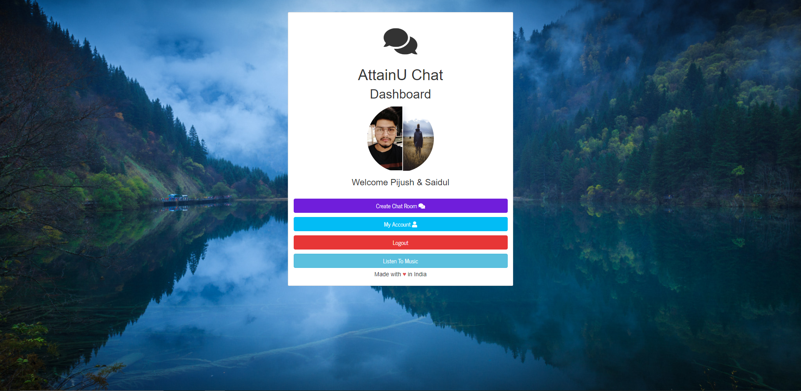
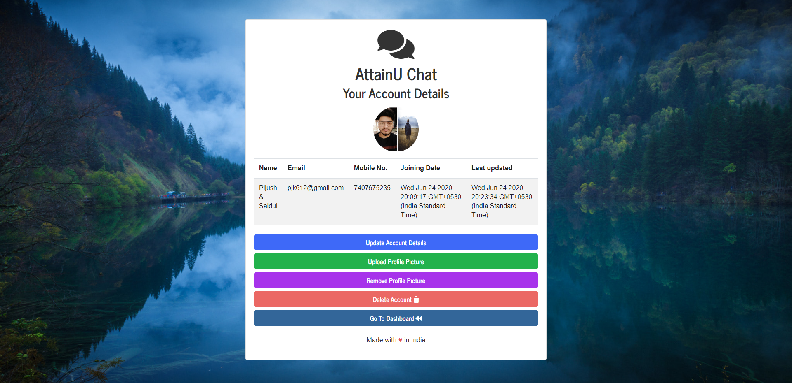
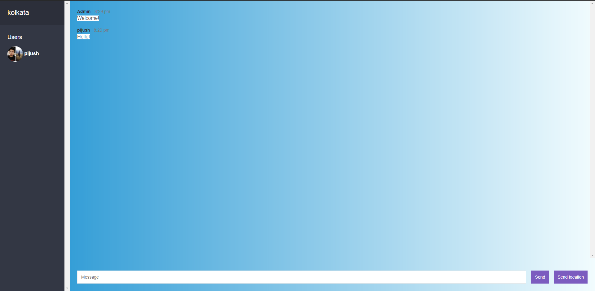

# Robin - Chat App

The objective of this website/project is to provide a platform to all who can just visit and log in to our website 
and they can create their own chat room where they can talk to their friend anywhere from the world, share their location 
(*and pictures, videos, documents - To Be Added Later!)

---

# Project Authors

Check Us Out

[Pijush Konar](https://github.com/pijush-konar-au7) & [Saidul Mondal](https://github.com/saidul-mondal-au7)

---

## Requirements

For development, you will only need Node.js and a node global package, Yarn, installed in your environement.

---

### Node
- #### Node installation on Windows

  Just go on [official Node.js website](https://nodejs.org/) and download the installer.
  Also, be sure to have `git` available in your PATH, `npm` might need it (You can find git [here](https://git-scm.com/)).

- #### Node installation on Ubuntu

  You can install nodejs and npm easily with apt install, just run the following commands.

      $ sudo apt install nodejs
      $ sudo apt install npm

- #### Other Operating Systems
  You can find more information about the installation on the [official Node.js website](https://nodejs.org/) and the [official NPM website](https://npmjs.org/).

If the installation was successful, you should be able to run the following command.

```
    $ node -v
    v12.16.2

    $ npm -v
    6.14.4
```
---

## Project Installation
  After installing node, this project will need many NPM Packages, so just run the following command to install all.

    $ git clone Here(https://github.com/attainu/robin-chat-app-two)
    $ cd robin-chat-app-two
    $ npm i

---

## Configuration

Open `robin-chat-app-two\config` then create and dev.env file and edit it with your infos. You will need:

- PORT=`Your Desired Port`
- NAME=`Your Database UserName`:
- PASSWORD=`Your MongoDB Password`
- CLUSTER=`@Your MongoDB Cluster Address`
- SENDGRID_API_KEY=`Enter Your SendGrid Email API Register On Sendgrid`

---

## Running The Project

```sh
    $ npm run dev
```


## NPM Packages Used -

- ##### @sendgrid/mail - It’s Mail Service npm for the SendGrid v3 Web Email API. We used it to send signup emails and account deletion emails to the users. You can find it out here - [@sendgrid/mail](https://www.npmjs.com/package/@sendgrid/mail)


- ##### bad-words - It is a javascript filter for bad words. It’s an npm module that you can find it out here at [bad-words](https://www.npmjs.com/package/bad-words). We have used this to add as a profanity filter in our chat room, to save our users from abuses/hatered of any sort inside the chat room.


- ##### bcryptjs - We are using bcrypt.js module to hash password of the user. It’s an npm module that you can find it out here at [bcryptjs](https://www.npmjs.com/package/bcryptjs).


- ##### connect-flash - It is used for the flash messages, you can look for more details here [connect-flash](https://www.npmjs.com/package/connect-flash).


- ##### ejs - It is the Embedded JavaScript templates. This is the view engine we used in our project. You can find more details here [ejs](https://www.npmjs.com/package/ejs).


- ##### express - It's the web framework for Node.js that we used to structure our web application. You can find more details here [express](https://www.npmjs.com/package/express).


- ##### express-ejs-layouts - It's the layout support for ejs in express. You can find more details here [express-ejs-layouts](https://www.npmjs.com/package/express-ejs-layouts).


- ##### express-session - It's for the storage of the cookies. Session data is not saved in the cookie itself, just the session ID. Session data is stored server-side.  For more details check here [express-session](https://www.npmjs.com/package/express-session).


- ##### mongoose - We used Mongoose because it provides schema-based solution to model our application data with MongoDB. Which has many features to use example - validation of user's data. For more details check here [mongoose](https://www.npmjs.com/package/mongoose).


- ##### multer - We used Multer for handling the image upload we provided in our web-application. As Multer is a node. js middleware which is used for handling multipart/form-data , which is primarily used for uploading files. For more details check here [multer](https://www.npmjs.com/package/multer).


- ##### passport - We have used Passport for authentication as it is one of the best authentication middleware available for Node.js. For more details check here [passport](https://www.npmjs.com/package/passport).


- ##### passport-local - We used Passport-local for authenticating user data for login, Passport strategy authenticates with a username and password here we are using the email and password to authenticate the user. For more details check here [passport-local](https://www.npmjs.com/package/passport-local).


- ##### sharp - We used sharp to resize the image uploaded by the user, as it is one of the high speed Node.js module to convert large images in common formats to smaller, web-friendly JPEG, PNG and WebP images of varying dimensions. For more details check here [sharp](https://www.npmjs.com/package/sharp).


- ##### socket.io - We used Socket.IO as it enables real-time bidirectional event-based communication. For more details check here [socket.io](https://www.npmjs.com/package/socket.io).


- ##### validator - We used validator to vadidate user data for example - user's entered email address. For more details check here [validator](https://www.npmjs.com/package/validator).

---

## Project Demo Website Hosted On Heroku -

#### Visit Here [AttainU Chat](https://attainu-chatapp.herokuapp.com/)


## Project Screenshots

Welcome Page/Default Page
<!--  -->

Signup Page
<!--  -->

Login Page
<!--  -->

Main Page/Dashboard
<!--  -->

Account Details Page
<!--  -->

Chat Room Create Page
<!--  -->

Chat Room Page
<!--  -->